!!! warning "聲明"
    本文記錄針對公開惡意樣本的實驗室復現分析，在隔離環境中重建攻擊流程以記錄技術細節。威脅情報（IOC）引用自公開情報平台，不含任何真實使用者或組織資訊，不構成對任何組織或個人的指控。

---

## 分析概覽

| 項目 | 內容 |
|---|---|
| **攻擊手法** | 社交工程釣魚 / 惡意程式投遞（malvertising） |
| **復現結果** | 端點防護工具偵測並自動隔離，測試環境無損害 |
| **偵測工具** | 端點防護工具（EPP/EDR） |
| **分析月份** | 2026 年 5 月 |

---

## 一、攻擊手法摘要

本次分析取材自一起實際流通的釣魚攻擊樣本，在隔離測試環境中模擬完整攻擊流程：測試端點「點選」惡意廣告後，被導向外觀仿冒 ChatGPT 的釣魚頁面；該頁面以「流量過大、需下載桌面版才能繼續使用」為由，誘導下載並執行安裝程式。

程式執行後，於測試端點植入偽裝成系統元件的惡意 DLL，並建立開機自動執行與常駐機制。端點防護工具於惡意檔案落地時即偵測並自動隔離，攻擊鏈在此截止

### 關鍵事實一覽

| 項目 | 內容 | 說明 |
|---|---|---|
| **惡意網域** | `openew.app` | 假冒下載站，多廠商標記惡意，屬近期註冊網域 |
| **惡意檔案** | `Profiler.exe` / `.dll` / `.bat` | 偽裝成系統「分析器」元件 |
| **持續化** | 自啟動 | 關機重開後仍會自動再執行 |
| **最終處置** | 端點防護工具工具自動隔離 | 風險已解除（Risk Resolved） |
| **實際損害** | 無 | 攻擊於前段被攔截 |

---

## 二、威脅背景

釣魚攻擊持續維持高檔。依反釣魚工作小組（APWG）季報，2026 年第一季全球通報約 97 萬次攻擊，較 2025 年第四季（約 85 萬次）回升 13.8%；2025 全年約 380 萬次，略高於 2024 年。值得注意的是，通報量僅為冰山一角——Microsoft 同期偵測到約 83 億封郵件型釣魚威脅，反映實際發生量遠高於通報數字。

近期攻擊者大量以熱門 AI 工具作為誘餌。2025 下半年至 2026 年初，資安廠商陸續揭露假冒 ChatGPT、Claude、Grok 等服務散布惡意程式之攻擊；其中一類手法透過 Google 廣告，將搜尋下載的使用者導向誘導頁面。較新的變體甚至不使用假網域，而是把惡意指令藏在 AI 平台「自身的分享對話頁」中，使傳統「檢查網址」的防護失效。本案與此類手法一致。

**資料來源：** APWG《Phishing Activity Trends Report》2026 Q1；Microsoft《Email Threat Landscape Q1 2026》；及 AdGuard、BleepingComputer、Pillar Security 等廠商揭露。數據以原始報告為準。

---

## 三、攻擊流程

本案攻擊鏈可分為七個環節。攻擊未使用系統漏洞，主要依賴社交工程誘導使用者自行下載執行。

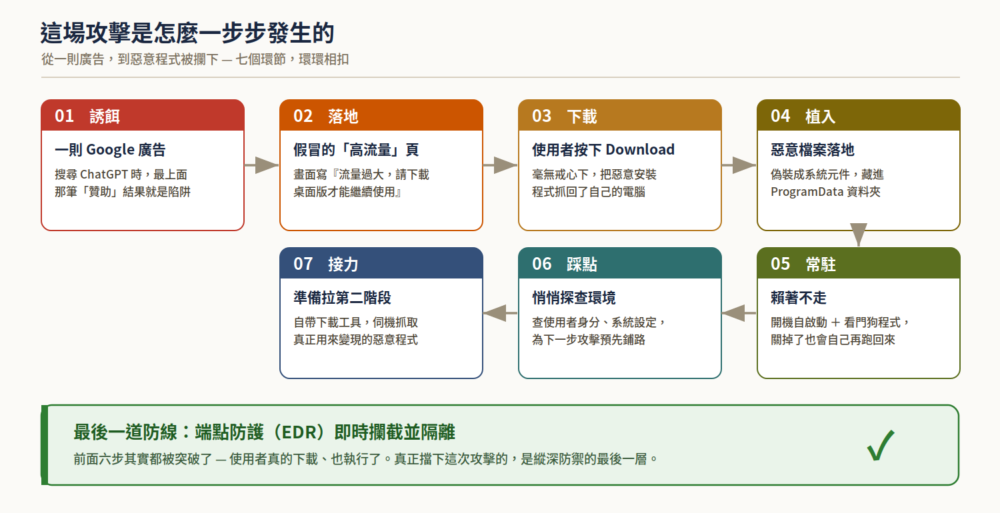
*圖一　攻擊七環節：自廣告誘導至惡意程式被攔截*

---

## 四、逐步分析

### 4.1　仿冒頁面

使用者看到的頁面標題為「We're experiencing high traffic right now」，以「下載桌面版才能繼續」為藉口，並提供 Download 按鈕。

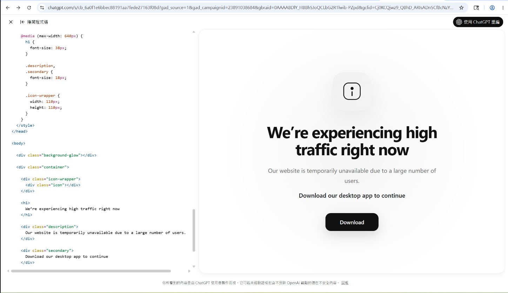
*圖二　仿冒 ChatGPT 之釣魚頁面*

!!! tip "可識別之破綻"
    - **藉口不合理：** ChatGPT 不會因流量大而要求下載桌面程式。
    - **網址含廣告參數：** 網址帶有 `gad_source`、`gclid` 等 Google 廣告追蹤碼，顯示來源為廣告而非官網。
    - **製造急迫感：** 「現在不下載即無法使用」為社交工程常見話術。

### 4.2　下載來源網域

下載來源網域 `openew.app` 經威脅情報平台查詢，已由多家資安廠商標記為惡意，且為近期才註冊之網域。

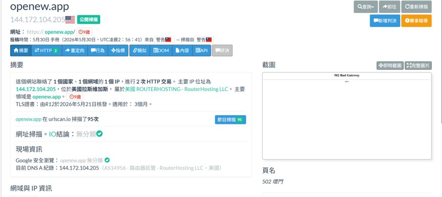
*圖三　威脅情報平台對該網域之摘要*

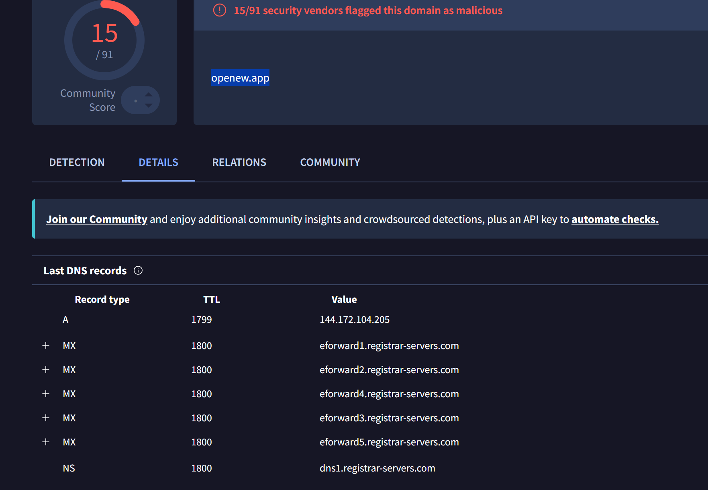
*圖四　另一平台顯示該網域被多家廠商標記為惡意（15 / 91）*

### 4.3　惡意檔案落地

惡意檔案落地於 `C:\ProgramData\Services\`，包含偽裝成分析器的 `Profiler.exe`、批次檔 `Profiler.bat` 及設定檔，且 `Profiler.exe` 設計成資料夾的形式，誘使使用者點擊。

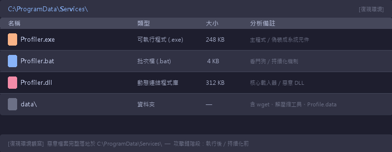
*圖五　復現環境觀察：惡意檔案落地路徑 C:\ProgramData\Services\意檔案落地路徑 C:\ProgramData\Services\*

`Profiler.exe` 屬性可見名實不符：名稱與圖示偽裝成系統元件，描述欄卻為 VbsEdit Script Launcher。此為偽裝程式之典型特徵。

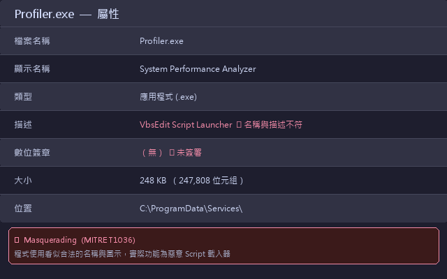
*圖六　復現環境重建：Profiler.exe 屬性——顯示名稱偽裝成系統元件，描述欄揭露真實身分（Masquerading T1036）exe 屬性——顯示名稱偽裝成系統元件，描述欄揭露真實身分（Masquerading T1036）*

### 4.4　持續化機制

惡意程式將自身加入開機自動啟動清單，並以批次檔建立看門狗常駐機制（詳見第六節技術分析）。工作管理員「啟動」分頁可見 `Profiler.exe`。

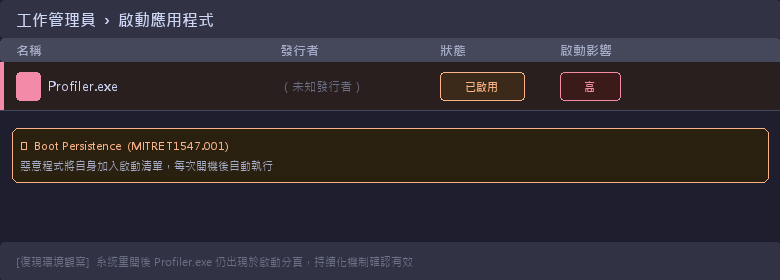
*圖七　復現環境觀察：系統重開後工作管理員啟動分頁仍存在 Profiler.exe（Persistence T1547）rofiler.exe（Persistence T1547）*

### 4.5　偵測與隔離

端點防護工具於惡意 DLL 落地時即偵測並自動隔離 `Profiler.dll`，狀態標記為風險已解除（Risk Resolved）。攻擊鏈在此截止，後續 payload 未執行。

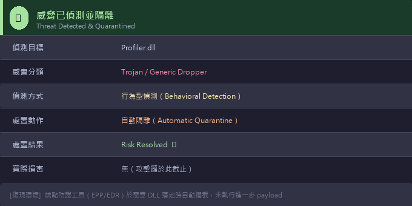
*圖八　復現環境：端點防護工具偵測並自動隔離 Profiler.dll——行為型偵測觸發，自動隔離處置動隔離 Profiler.dll——行為型偵測觸發，自動隔離處置*

---

## 五、惡意檔案佐證

被隔離之 DLL 經威脅情報平台分析，由多家資安廠商判定為木馬程式，威脅標籤為 `trojan.genericfca`。主流引擎（BitDefender、CrowdStrike、Emsisoft 等）一致給出惡意判定。

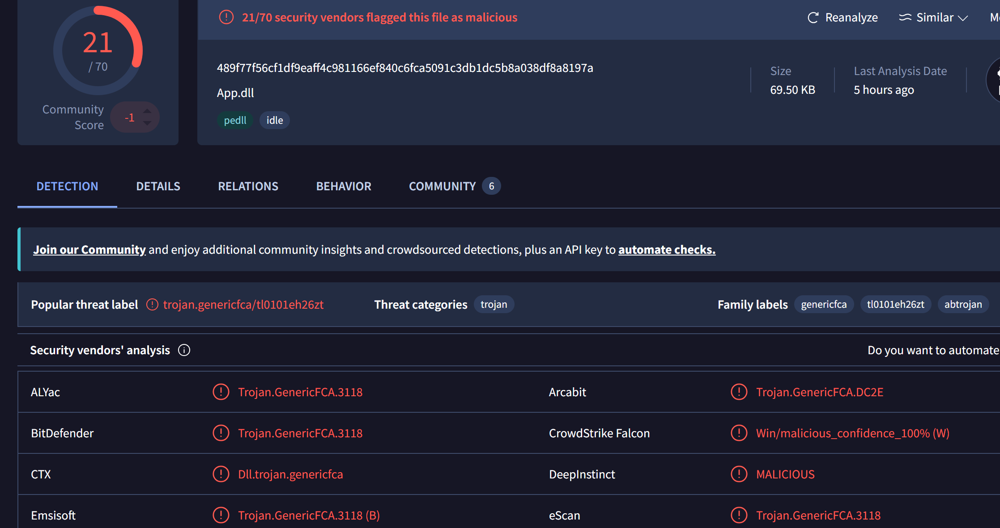
*圖九　惡意 DLL 經分析，21 / 70 家廠商判定為木馬*

該檔案之關聯資訊顯示其與其他可疑樣本（PowerShell 指令碼、測試執行檔）存在關聯，並內含 HTML 等捆綁檔案，符合下載器 / 載入器類惡意程式特徵。

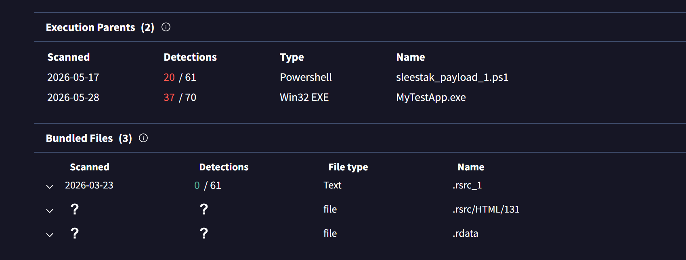
*圖十　惡意檔案之關聯樣本與捆綁內容*

---

## 六、技術分析

### 6.1　檔案分工

本案非單一惡意程式，而由多個檔案分工協作。各元件角色與所屬攻擊階段如下圖。

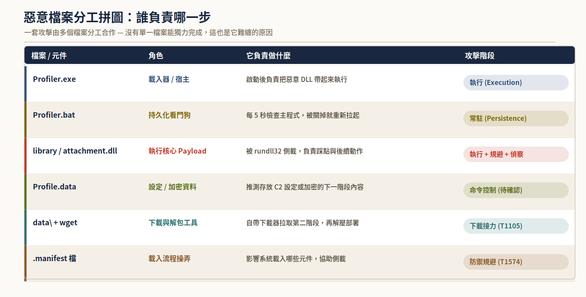
*圖十一　惡意檔案分工：各元件角色與攻擊階段*

### 6.2　看門狗（持續化）

`Profiler.bat` 經混淆處理（大量無用變數與假註解）。去除混淆後，其核心為一看門狗迴圈：

```
:loop → 等待 5 秒 → 檢查 Profiler.exe 是否在執行
若未執行 → 立即重新啟動 Profiler.exe → 等待 2 秒
回到 :loop 持續監看
```

**效果：** 主程式一旦被關閉（含遭防毒移除），看門狗於數秒內將其重新啟動。清除時須同時移除此批次檔，否則主程式將復活。

### 6.3　執行核心 DLL

惡意 DLL（沙箱中以 `library.dll` / `attachment.dll` 等檔名出現）不直接執行，而透過 Windows 內建程式 `rundll32` 代理載入（序號匯出 `#1`），藉此規避以執行檔信譽為主之偵測。

沙箱中觀察到之行為僅止於使用者與系統偵察（讀取使用者 SID、系統語系與設定），其主要惡意功能未於分析環境展開。

!!! warning "研判：未展開不代表無害"
    DLL 未展開主功能，研判為反沙箱（偵測到分析環境而停止）或載入器特性（第二階段需特定條件才下載）。

    **結論：** 不可因沙箱未捕捉到惡意行為即判定無害。其角色為打開入口，實際危害發生於後續階段。

### 6.4　下載接力機制

DLL 本身無明顯對外回傳機制。該機制位於 `data\` 資料夾，內含 wget 與解壓縮工具：

| 元件 | 角色 |
|---|---|
| `wget` | 對外連線下載第二階段惡意程式（即原本缺少之回傳 / 拉取機制） |
| 解壓縮工具 | 將下載之壓縮包解開、部署為可執行內容 |
| `Profile.data` | 推測存放 C2 設定或加密之下一階段內容，由前段程式讀取解開 |

故回傳機制非寫死於 DLL，而以自帶下載工具之方式分段準備。沙箱因觸發條件未滿足，第二階段未下載，故呈現斷點。第二階段實際內容須以靜態逆向或記憶體取證進一步確認。

---

## 七、MITRE ATT&CK 對照

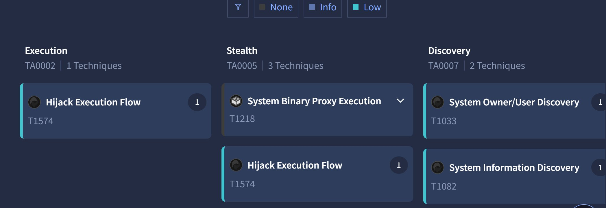
*圖十二　本案對應之 ATT&CK 戰術分類*

| 階段 | 本案手法 | 技術編號 |
|---|---|---|
| 初始接觸 | 仿冒 AI 服務頁面 + 惡意廣告 | T1566 / T1189 |
| 使用者執行 | 誘導使用者下載並執行 | T1204 |
| 防禦規避 | `rundll32` 代理載入、偽裝系統元件 | T1218.011 / T1036 |
| 常駐 | 開機自啟動 + 看門狗批次檔 | T1547 / T1053 |
| 偵察 | 查使用者與系統資訊 | T1033 / T1082 |
| 下載接力 | 自帶 `wget` 拉取第二階段 | T1105 |

本案捕捉到者為攻擊鏈前段（執行、規避、偵察、準備接力）。未觀測到成功之對外連線、橫向移動或資料竊取。

---

## 八、潛在影響（推論）

本案未發生實際損害。以下為「若未被攔截」依此類惡意程式常見後續之風險推論，**非已發生事實**。

- **憑證與工作階段竊取：** 竊取瀏覽器密碼、Cookie、Token，導致帳號被接管。
- **金融帳號盜用：** 攔截網銀 / 支付工作階段，造成直接財務損失。
- **第二階段 payload：** 作為灘頭堡再拉取勒索軟體等，導致檔案加密、營運中斷。
- **橫向移動：** 以踩點資訊擴大為全網事件。

---

## 九、識別與防護建議

### 9.1　使用者識別要點

1. **認網址而非外觀：** 檢查網址是否為官方網域，留意廣告追蹤參數。
2. **知名服務從官網或官方商店取得：** 勿因「流量過大」提示而另行下載安裝程式。
3. **對急迫性訊息保持警覺。**
4. **不確定先勿執行，通報資安 / IT。**

!!! danger "事件應變"
    **若已下載或執行，立即通報資安 / IT 或 MDR 團隊，勿自行刪檔或重灌。**

    保留現場以利確認影響範圍。端點防護工具正常運作時，此類攻擊可在前段被阻斷，避免實質損害阻斷，避免實質損害。

### 9.2　防護強化

- **網路：** 導入 DNS / Web 過濾，封鎖低信譽與新註冊網域、惡意廣告。
- **權限：** 限制一般使用者於 `ProgramData` 等路徑之寫入 / 執行。
- **偵測：** 建立行為型規則（如使用者目錄 DLL 經 `rundll32` 載入、下載來源與品牌不符），較單一 IOC 耐用。
- **人員：** 定期社交工程教育，並建立明確之可疑檔案 / 網站通報管道。

---

## 十、結論

本次復現分析針對一起透過惡意廣告散布、假冒 ChatGPT 的釣魚樣本，在隔離測試環境中完整重建了攻擊鏈：從仿冒頁面誘導下載，到惡意程式落地並建立持續化機制，最終由端點防護工具於落地階段偵測並隔離。

復現過程凸顯三點：其一，攻擊起點為社交工程而非系統漏洞，對釣魚誘餌的識別能力是第一道防線；其二，縱深防禦不可或缺，端點防護在前段失效後守住最後一關；其三，及早通報是控制影響範圍的影響範圍的關鍵。

---

## 附錄：攻擊者視角模擬（防禦研究）

!!! note "說明"
    以下內容為純防禦研究目的，模擬攻擊者如何快速複製此類攻擊，以協助了解防護盲點。

部署釣魚網站的基本邏輯是「快速且可大量迭代」。該釣魚連結後來雖然已不存在頁面，且連結連上的惡意網域也因信評問題而被瀏覽器攔截。但只要把原本的 HTML 複製給 AI 請其生成畫布，就可以快速複製類似網站——此時的網域名稱仍顯示 `chatgpt.com`，對一般使用者難以分辨（甚至不會注意）。建立新的惡意網域（用來布置假網站）也不會花費太多心力，接著投放廣告增加觸及率即可。

唯此案例只是冰山一角，實際環境必定隱藏更多惡意手法。

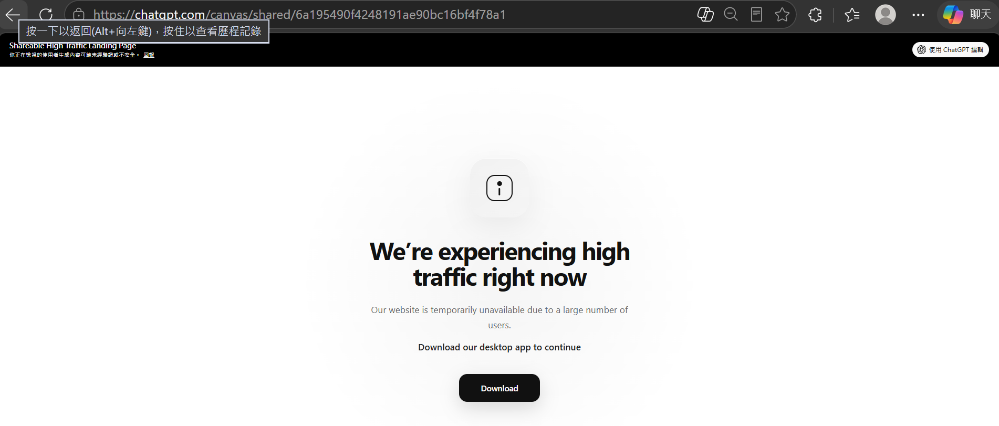
*圖十三　自建假網站示意（不到一分鐘，下方的下載連結可帶入任意目標）*

---

*本文發布於個人技術作品集，所有樣本分析均在隔離環境中進行析均在隔離環境中進行。如有問題請透過 About 頁面聯絡。*
